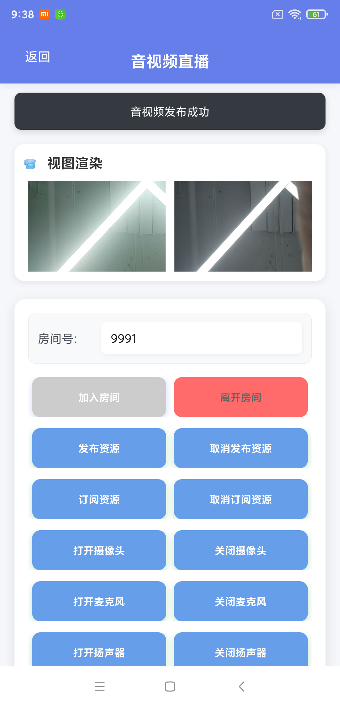
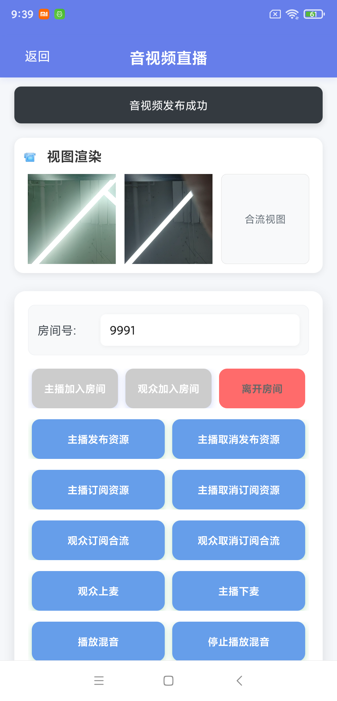

# 融云RTC快速演示项目

这是一个基于 uni-app 框架的融云RTC（实时音视频通信）快速演示项目，集成了融云的RTC SDK和IM SDK。

## 功能特性

- ✅ 用户登录系统（支持自动登录）
- ✅ 融云SDK集成（RTC + IM）
- ✅ 音视频通话功能
- ✅ 摄像头/麦克风控制
- ✅ 房间管理
- ✅ 跨平台支持（Android、iOS）

## 项目结构

```
uniapp-rtc-quickdemo/
├── pages/
│   ├── login/login          # 登录页面
│   ├── index/index          # 首页
│   └── rtc/metting            # 会议
│   └── rtc/live/            # 直播
├── utils/
│   └── IMEngineUtils.js    # 融云SDK工具类
├── config/
│   └── RCConfig.js    # 融云配置文件
├── static/             # 静态资源
├── manifest.json       # 应用配置
└── pages.json          # 页面路由配置
```

## 快速开始

### 1. 配置融云AppKey

编辑 `config/RCConfig.js` 文件，将您的融云AppKey替换配置：

```javascript
export default {
	// 融云AppKey - 请替换为您的实际AppKey
	appKey: '', 
	
	// 测试用户列表 - 可以方便地添加更多用户
	testUsers: [
		{
			id: '',  // 需要替换成您的 userId
			name: '测试用户1',
			token: '',  // 需要替换成您的 Token
			avatar: '👤',
			description: '主要测试账户'
		},
		{
			id: '', // 需要替换成您的 userId
			name: '测试用户2', 
			token: '', // 需要替换成您的 Token
			avatar: '👤',
			description: '备用测试账户'
		},
		{
			id: '', // 需要替换成您的 userId
			name: '测试用户3', 
			token: '', // 需要替换成您的 Token
			avatar: '👤',
			description: '备用测试账户'
		}
	],
} 
```

### 2. 安装依赖

确保已安装融云原生插件：
- RongCloud-IM-V2（融云即时通讯SDK）
- RongCloud-RTC（融云RTC SDK）

## 使用说明

### 登录流程

1. 首次进入应用会跳转到登录页面
2. 输入用户ID（任意字符串）
3. 点击登录按钮
4. 系统会自动初始化融云SDK
5. 登录成功后跳转到首页

### 自动登录

- 登录信息会保存在本地存储中
- 下次进入应用会自动检查登录状态
- 如果已登录，直接跳转到首页

### Demo 效果

#### 会议功能

*支持多人音视频会议，实时音视频通话*

#### 直播功能

*观众端界面，支持观看直播*


*主播端界面，支持开启直播*


## 技术栈

- **前端框架**: Vue 3
- **跨平台框架**: uni-app
- **音视频通信**: 融云RTC SDK
- **即时通讯**: 融云IM SDK
- **状态管理**: 本地存储

## 注意事项

1. **AppKey配置**: 必须配置正确的融云AppKey才能正常使用
2. **原生插件**: 需要安装融云的原生插件
3. **权限申请**: 音视频功能需要摄像头和麦克风权限
4. **网络环境**: 确保网络连接正常

## 开发说明

### 添加新功能

1. 在 `utils/IMEngineUtils.js` 中添加新的SDK方法
2. 在对应页面中调用SDK方法
3. 更新UI界面

### 错误处理

项目包含完整的错误处理机制：
- SDK初始化失败
- 网络连接失败
- 权限申请失败
- 房间操作失败

### 调试

- 查看控制台日志了解SDK状态
- 使用 `console.log` 调试关键步骤
- 检查网络连接和权限状态

## 常见问题

### Q: 登录时提示"请先配置融云AppKey"
A: 请检查 `config/RCConfig.js` 文件中的AppKey配置

### Q: 无法加入房间
A: 检查网络连接和SDK初始化状态

### Q: 摄像头/麦克风无法使用
A: 检查设备权限是否已授权

## 许可证

MIT License

## 联系方式

如有问题，请联系开发者或查看融云官方文档。 